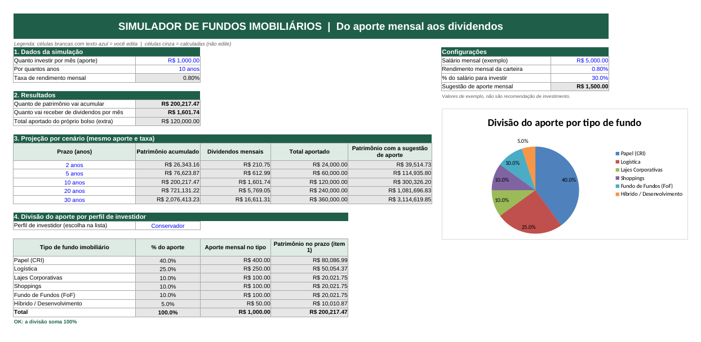
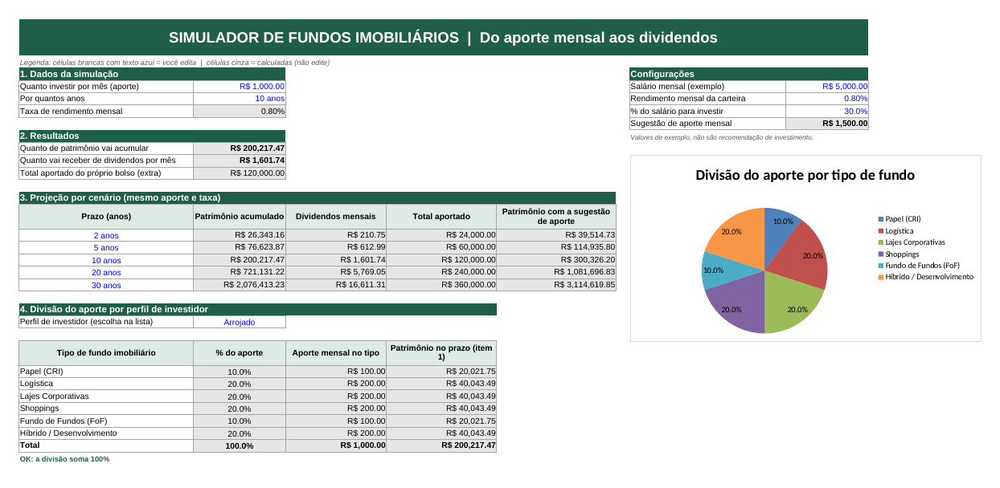

# Simulador de Fundos Imobiliários (Excel)

Planilha com cara de aplicativo que simula o investimento mensal em fundos imobiliários, do aporte de cada mês ao patrimônio acumulado e aos dividendos mensais. Também projeta cenários de 2 a 30 anos e divide o aporte entre seis tipos de fundo, conforme o perfil de investidor escolhido numa lista.

> Todos os valores (salário, aporte, taxa e percentuais) são **exemplos didáticos**. Não são recomendação de investimento.

**Arquivo:** [`simulador-fiis.xlsx`](simulador-fiis.xlsx)

## Prints (mesma simulação, dois perfis)

Aporte de R$ 1.000,00 por mês, 10 anos e 0,80% ao mês. Só o perfil muda: o patrimônio total é o mesmo, mas a divisão do aporte e o gráfico mudam.

| Conservador | Arrojado |
|---|---|
|  |  |

## Como usar

1. Abra a aba **Simulador**.
2. Preencha as células brancas com texto azul: aporte, anos, e as configurações (salário, rendimento mensal e % do salário).
3. Escolha o perfil na lista do item 4.
4. As células cinza são calculadas. Não é preciso editá-las (a aba está protegida **sem senha**; para liberar: Revisão > Desproteger Planilha).

## As cinco perguntas e onde aparece cada resposta

| Pergunta | Onde aparece (aba Simulador) |
|---|---|
| Quanto investir por mês? | `C6` (entrada, intervalo `aporte`) |
| Por quantos anos? | `C7` (entrada, intervalo `anos`) |
| Qual a taxa de rendimento mensal? | `C8` (exibe `taxa_mensal`, que é digitada em `I7`) |
| Quanto de patrimônio vai acumular? | `C11` (intervalo `patrimonio`) |
| Quanto vai receber de dividendos por mês? | `C12` (intervalo `dividendos_mensais`) |

Com os valores de exemplo (R$ 1.000/mês, 10 anos, 0,80% ao mês): patrimônio de **R$ 200.217,47** e dividendos de **R$ 1.601,74 por mês**.

## Como o VF e o PROCV entram nos cálculos

**VF** (no Excel em inglês, `FV`) calcula o valor futuro de aportes iguais, mês a mês:

```
=VF(taxa_mensal; anos*12; -aporte)
```

- `taxa_mensal`: o rendimento de cada mês.
- `anos*12`: o prazo convertido em número de meses.
- `-aporte`: o aporte entra negativo (dinheiro que sai do bolso) para o resultado sair positivo.

Os dividendos mensais são o patrimônio vezes a taxa: `=patrimonio*taxa_mensal`.

O mesmo VF se repete nos cenários de 2, 5, 10, 20 e 30 anos (tabela do item 3), trocando só o prazo da linha, e também em cada tipo de fundo (item 4), usando o aporte daquele tipo.

**PROCV** (`VLOOKUP`) traz o percentual de cada tipo de fundo para o perfil escolhido. Como a busca depende de **duas** informações (perfil e tipo), uso uma **chave composta** na aba **Apoio**:

- Coluna A da tabela: `=B5&"|"&C5`, que gera textos como `Moderado|Logística`.
- Na aba Simulador: `=PROCV(perfil_selecionado&"|"&B27; tabela_perfis; 4; FALSO)`.

A chave fica na primeira coluna do intervalo `tabela_perfis`, que é onde o PROCV procura. O `4` devolve a coluna do percentual, e o `FALSO` exige correspondência exata.

## Intervalos nomeados

| Nome | Refere-se a | O que é |
|---|---|---|
| `aporte` | Simulador!C6 | Aporte mensal |
| `anos` | Simulador!C7 | Prazo em anos |
| `patrimonio` | Simulador!C11 | Patrimônio acumulado |
| `dividendos_mensais` | Simulador!C12 | Dividendos por mês |
| `salario` | Simulador!I6 | Salário mensal (exemplo) |
| `taxa_mensal` | Simulador!I7 | Rendimento mensal da carteira |
| `pct_aporte` | Simulador!I8 | % do salário sugerido para investir (30%) |
| `sugestao_aporte` | Simulador!I9 | `salario * pct_aporte` |
| `perfil_selecionado` | Simulador!C24 | Perfil escolhido na lista |
| `tabela_perfis` | Apoio!A5:D22 | Tabela de busca do PROCV |
| `lista_perfis` | Apoio!F5:F7 | Origem da lista suspensa (validação de dados) |

## Percentuais de cada perfil

Os percentuais são um **exemplo didático**, definidos por mim como ponto de partida (não vieram de nenhuma carteira real nem de recomendação). A lógica: o perfil conservador pesa mais em fundos de papel (recebíveis), e o arrojado distribui mais em tijolo e em desenvolvimento. Cada perfil soma 100%, e a aba Apoio confere isso com `SOMASE`.

| Tipo de fundo | Conservador | Moderado | Arrojado |
|---|---:|---:|---:|
| Papel (CRI) | 40% | 25% | 10% |
| Logística | 25% | 20% | 20% |
| Lajes Corporativas | 10% | 15% | 20% |
| Shoppings | 10% | 15% | 20% |
| Fundo de Fundos (FoF) | 10% | 15% | 10% |
| Híbrido / Desenvolvimento | 5% | 10% | 20% |
| **Total** | **100%** | **100%** | **100%** |

## O que mudei em relação à ferramenta do Expert

- **Segunda simulação com a sugestão de 30% do salário:** coluna extra na tabela de cenários mostrando o patrimônio caso o aporte fosse a sugestão.
- **Gráfico de pizza** com a divisão do aporte, que muda junto com o perfil.
- **Conferências automáticas:** aviso se a divisão por perfil não somar 100% e soma por perfil na aba Apoio.
- **Linhas extras:** total aportado do próprio bolso (para comparar com o patrimônio) e patrimônio projetado por tipo de fundo.
- **Proteção da planilha:** só as células de entrada ficam editáveis (sem senha).
- **Seis tipos de fundo e percentuais próprios**, escolhidos por mim.

## Estrutura

```
simulador-fundos-imobiliarios/
├── simulador-fiis.xlsx
├── README.md
└── prints/
    ├── perfil-conservador.png
    └── perfil-arrojado.png
```
